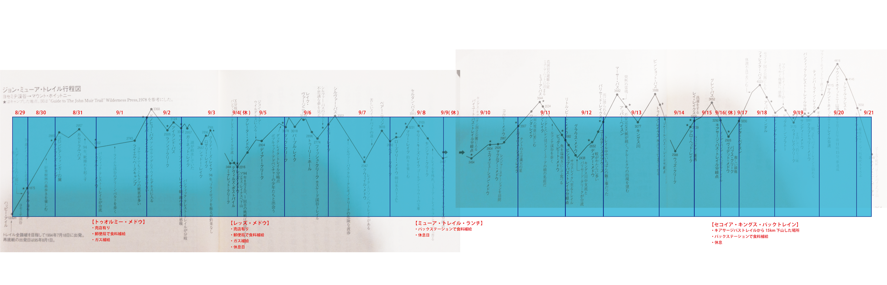

TrailPlan
=========

# ジョン・ミューア・トレイルとは
ジョン・ミューア・トレイル（John Muir Trail）は、アメリカの長距離自然歩道。カリフォルニア州内を、ヨセミテ峡谷（ヨセミテ国立公園）からマウント・ホイットニーまで、340キロメートルにわたって縦走する。トレイルの大部分はパシフィック・クレスト・トレイルの一部になっている。アメリカにおける「自然保護の父」と呼ばれるナチュラリスト、ジョン・ミューアにちなんで命名されている。

　  
　  
# 旅程
|月日|予定|
|---|---|
|8/27|16:45 大阪KIX → 10:50 サンフランシスコSFO (UA34便)   12:00 ~ 16:00 買出し及び切符の購入   ＜ホテル情報＞|
|8/28|06:45 フェリーターミナル発 - (コネクションバス）- エメリーヴィル着   07:40 エメリーヴィル発 - (アムトラック) - 10:31 マーセド着   10:50 マーセド発 - (ヨセミテ行きバス）- 13:10 ヨセミテロッジ着   ウィルダネスパーミットの取得   サニーサイドキャンプに宿泊|
|8/29   ~   9/21|トレイル内（下記詳細図参照）|
|9/22|09:40 ローンパイン発 - (Crest Inyo Mono Transit:バス) $25   12:45 ランカスター着   18:05 ランカスター発 - (Metrolink:電車)   20:25 ロス着 |
|9/23|予備日|
|9/24|予備日|
|9/25|12:45 ロサンゼルスLAX → 機内泊|
|9/26|→ 16:25 東京NRT (ANA5便)   20:30 HND → 21:45 大阪KIX （ANA147便)|

行程詳細（画像クリックで拡大）

　  
　  
# 連絡先
#### ■持参しているiPhone
日本で使用しているiPhoneを持って行って国際ローミングで使用。  
TEL 090-4474-0390  
料金 ¥140 ~ ¥160/分
 

#### ■サンフランシスコ宿泊先
・宿泊先未定

#### ■トレイル上の緊急連絡先
##### ① Yosemite National Park  
ジョン・ミューア・トレイルの前半1/4を管轄とするのがYosemite National Park。  
TEL : +1-209-379-1992
##### ② Fresno County Sheriff's Office
ジョン・ミューア・トレイルの1/4以降で本人の居場所が明確でない場合、管轄範囲を判断するのが厄介。そんなときはここに電話をかければ広い範囲で対応してくれる。 
TEL : +1-559-488-3111(24時間対応)
##### ③Sequoia and Kings Canyon National Parks
トレイルの後半1/2を管轄するのがSequoia and Kings Canyon National Parks。  
TEL : +1-1-559-565-3341(24時間対応)

#### ■参考リンク
https://groups.yahoo.com/neo/groups/johnmuirtrail/conversations/topics/5652

　  
　  
# 装備一覧
##### [Google Docsにて管理](https://docs.google.com/spreadsheets/d/1l-u_W1qRfV-6c7E0FJOjkHLvm2g50_WATEmW16Noy3M/edit#gid=0)

　  
　  
# 食料計画
|時間|内容|
|---|---|
|朝食(洋)|ミューズリー 50g(160kcal)   スープ 10g (30kcal)   カロリーメイト×2本 40g(200kcal)|
|朝食(和)|お粥 16g(61kcal)   汁物 15g(75kcal)   カロリーメイト×2本 40g(200kcal)|
|行動食|カロリーメイト×2本40g(200kcal)   ミックスナッツ × 50g(300kcal)   エナジーバー60g (200kcal)   柿ピー1袋|35g(165kcal)   カントリーマアム3枚(30g)150kcal|
|夕食(洋)|パスタ 100g(280kcal)   おかず 洋風の何か 50g (100kcal)   汁物・スープ 10g(30kcal)|
|夕食(和)|ごはんもの 100g(387kcal)   おかず・丼 25g(100kcal)   汁物・スープ 10g(30kcal)|

　  
　  
# 補給ポイント
## ①Tuolumne Medow Post Office
#### 住所
c/o General Delivery  Tuolumne Meadows Yosemite National Park, CA  
#### 梱包方法
・自分の名前を記載  
・無料  
・USPS限定
　  
　  
## ②[Mammoth Lake Post Office](http://www.uspspostoffices.com/ca/mammoth-lakes/mammoth-lakes)
#### 住所
3330 Main St, Mammoth Lakes, CA 93546

#### 梱包方法
・郵便局留にするために以下のように記載  
To: Takeru Yoshihara  
GENERAL DELIVERY  
3330 Main St, Mammoth Lakes, CA 93546 USA

#### アクセス
バスでReds Medow General Storeを出発し、キャンプ場前のバス停を経由してMain Lodgeまで(往復＄７)このMain Lodge からThe Villageというところまで無料シャトルで行くと街に出る。The Villageはいろいろなお店やレストランが集まっていて、そこからMain St. を東に10分〜15分程歩くと郵便局。
※シャワー浴びたいときはMammoth Mountain Innへ。$5
　  
　  
## ③[Muir Trail Ranch](http://www.muirtrailranch.com/resupply.html)
#### 住所
Muir Trail Ranch Resupply  
PO Box 176  
Lakeshore, CA 93634  

#### 梱包方法
・ピックアップ予定日を外側に記入  
・5ガロン以下のバケツか段ボールを使用  
・バケツを使用の場合、宛先ラベルは必ず天面に貼る  
・段ボールの場合、アドレスは1面にだけ貼る。いくつか貼ってると差し戻される  
・ピックアップ予定日と受け取り人名を記しておく  
・海外からの送付の場合は現地での支払いが可能なので、その旨を記しておく  
・補給予定日の3週間前には荷物を送っておく  
・費用は$65  

## ④[Pine Creek Pack Station / Sequoia Kings Pack Trains](http://www.google.co.jp/url?sa=t&rct=j&q=&esrc=s&source=web&cd=1&ved=0CCEQFjAA&url=http%3A%2F%2Fxa.yimg.com%2Fkq%2Fgroups%2F5334735%2F1254039484%2Fname%2FSequoia%2BKings%2BPack%2BTrains%2BPackaging%2BInformation.pdf&ei=YC7qU7uGJJXn8AX3moCQAQ&usg=AFQjCNEca4mLRA45Aq9EdgfDUL2aEiDBmQ&sig2=iHL-iCWG2GLestznkgclJg&bvm=bv.72676100,d.dGc)
キアサージパスのトレイルを外れて12kmほど下山したオニオンバレーにあるステーション。ステーションにはキャンプ場やシャワーも完備してある。

#### 梱包方法
・頑丈な段ボールもしくはプラスティックの箱を使用すること。  
・最大サイズは20×12×12(多分インチ換算）  
・最大重量は50ポンド。  
・数に上限は無し。 
・それぞれの荷物に1/3, 2/3 3/3のように番号を振っておく。  
・箱のそれぞれの面に以下の情報を貼っておく  
-パックステーションの名前  
-パックステーションンの住所  
-団体名  
-ピックアップ日  
-目的地  
・箱の外に「Message to Packer」と書かれた封筒を貼っておく。  
・封筒の中には以下の情報を入れておく。支払いのための情報になる。  
-自分の名前  
-電話番号  
-旅程のコピー  
・荷物預かりの費用は$125

